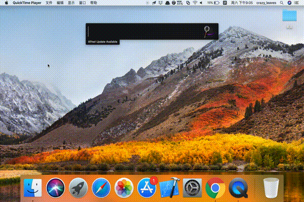
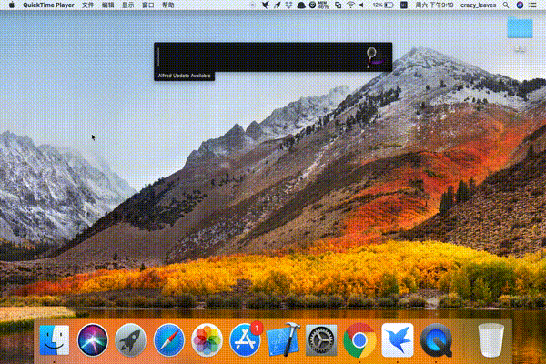

# 动漫花园下载脚本

在使用该Workflow之前请先确保：

1. 能够在浏览器中打开动漫花园网站（需科学上网）。
2. 拥有能运行的Alfred V3版本并且开通了Powerpack功能。

## 使用手册

功能主要分为两个部分，分别是**利用什么进行搜索**和**选择指定番剧之后触发了什么行为。**

1. 目前支持三种搜索：关键字搜索，分类搜索，联盟（字幕组）搜索。
2. 当在alfred中展示了多个番剧并进行选择时：
    - enter键会打开默认浏览器并跳转到动漫花园下载页面。
    - command键会打开Folx并导入番剧的磁力链接，3s后会模拟一次回车按键开始下载。
    - alt键会打开迅雷并导入番剧的磁力链接，3s后会模拟一次回车按键开始下载。

## 视频演示
1. 搜索辉夜大小姐关键字并打开浏览器进行下载。

 高清传送门：https://blog-1252269821.cos.ap-shanghai.myqcloud.com/keyword.gif
2. 搜索季度全集分类并打开迅雷进行下载。

 高清传送门：https://blog-1252269821.cos.ap-shanghai.myqcloud.com/category.gif

## Q & A

Q1: 无法在Mac端成功唤起迅雷？ 
A1: 请确保下载迅雷的最新版本，并且使用该Workflow的时候最好能让迅雷已在后台运行。

Q2: 为什么显示番剧信息的时候title没有了字幕组？ 
A2: 由于动漫花园的title过长，目前会将title的一个[]去掉，subtitle里面会展示完整的信息。建议调整alfred theme缩小字体大小来显示完整的番剧信息。

## ToDo

- [ ] 将选择操作作为一个List Filter进行展示（无需记忆快捷键）
